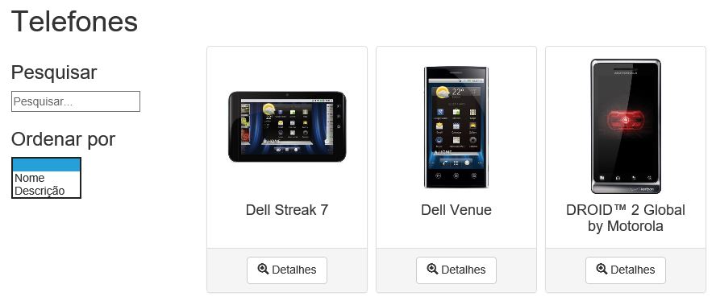
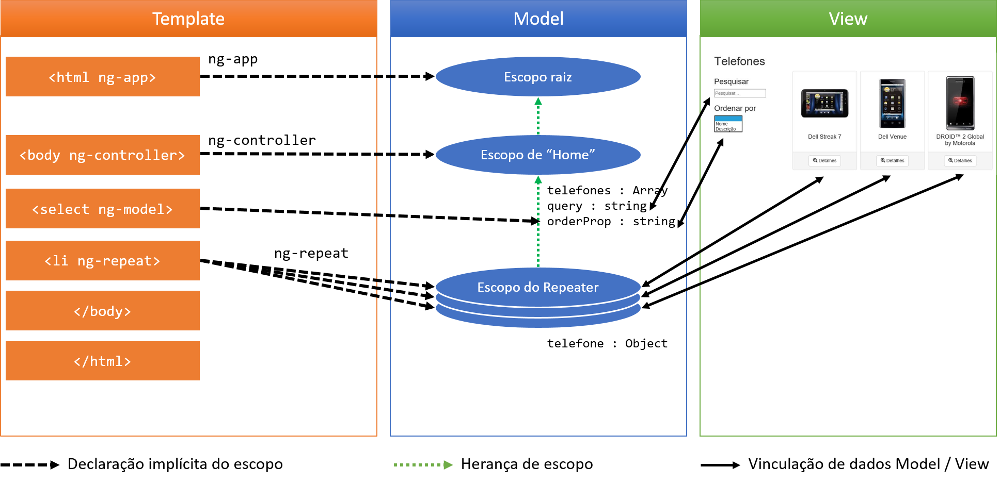

# Passo 4 - Two-way data binding

O **Passo 4** adiciona a funcionalidade que permite ao usuário escolher qual a forma de ordenação da lista de telefones. A figura a seguir ilustra o resultado final deste passo.



Abaixo da caixa de pesquisa está uma interface que permite ao usuário escolher se deseja ordenar a lista de telefones por nome ou por descrição.

## Template

O arquivo `index.html` contém o trecho de código a seguir:

```html
<!doctype html>
<html lang="pt-br" ng-app="phonecat">
<head>
...
</head>
<body>
<div class="container" ng-controller="Home">
    <h1>Telefones</h1>
    <div class="row">
        <div class="col-md-3">
            <h3>Pesquisar</h3>
            <input type="text" ng-model="query" placeholder="Pesquisar...">
            <h3>Ordenar por</h3>
            <select ng-model="orderProp">
              <option value="name">Nome</option>
              <option value="description">Descrição</option>
            </select>
        </div>
        <div class="col-md-9">
            <ul id="listaDeTelefones">
                <li ng-repeat="telefone in telefones | filter:query | orderBy:orderProp">
                    <div class="panel panel-default">
                        ...
                    </div>
                </li>
            </ul>  
        </div>
    </div> <!--/row-->
</div> <!--/container-->
</body>
</html>
```

O elemento `select` possui a diretiva `ngModel` (representada pelo atributo `ng-model`) que faz com que ocorra uma vinculação de dados de duas vias (*two-way data binding*). A figura a seguir ilustra e ajuda a explicar esse conceito.



O **model** (definido no escopo **controller** `Home`) contém três elementos:
* `telefones`: `Array` que representa a lista de telefones
* `query`: string que representa a consulta (**Passo 3**)
* `orderProp`: string que representa a ordenação da lista de telefones

O fato de afirmar "definido no escopo do controller Home" não implica em ter os elementos doo **model** definidos explicitamente no controller. Isso quer dizer que o model pode ser definido implicitamente no escopo do **controller** por meio do **template** ao ser utilizada a diretiva `ng-model`.

Neste caso, o elemento `select` está vinculado à propriedade `orderProp` do **model**. A partir de então, esta propriedade está disponível no escopo do **controller**. Qualquer modificação no `select` provocará uma alteração de `orderProp`. Assim, a lista de telefones será ordenada como esperado.

A lista de telefones é filtrada (**Passo 3**) e também ordenada dinamicamente. O responsável por isso é o filtro **orderBy**. O elemento `li` contém `ng-repeat="telefone in telefones | filter:query | orderBy:orderProp"`. Isso significa que os filtros estão sendo utilizados *em cadeia*. Esse é um recurso importante do Angular: aplicar filtros encadeados. 

A sintaxe do filtro `orderBy` é similar à do `filter`:

```
orderBy:expressão
```

Neste caso, `expressão` é a propriedade `orderProp` do **model** (definida no `select`).

> **Exercícios**
> 1. Modifique o código para que a ordenação possa ser feita considerando outros atributos dos objetos da lista de telefones.
> 2. Como definir um "valor padrão" para a propriedade `orderProp` diretamente no **controller**? Qual o efeito disso no comportamento do aplicativo?