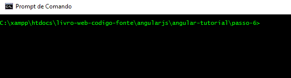

# Passo 6 - Carregando dados via AJAX

O **Passo 6** adiciona a funcionalidade de carregar dados dos telefones via AJAX (requisições assíncronas ou XHR), ao invés de manter os dados deles em um `array` diretamente no código.

Antes de continuar neste passo, é necessário que o projeto utilize um servidor web. Como sugestão, em tempo de desenvolvimento, pode ser utilizado o [**http-server**](https://www.npmjs.com/package/http-server).

## npm e dependências 

Na prática, o projeto referente a este passo que é disponibilizado no repositório do código-fonte do livro já está devidamente configurado para funcionar com esta e outras dependências. Na sua cópia local do repositório, no diretório referente ao **Passo 6**, no prompt de comando, digite:

```
npm install
```

Este comando instala as dependências:
* de **produção**
    * `jquery`
    * `bootstrap`
    * `angular`
* de **desenvolvimento**
    * `http-server`

Se você iniciar o projeto, então terá que adicionar as dependências. Para isso, é necessário utilizar o **npm**. Você pode acompanhar uma breve referência do **npm** [aqui mesmo neste livro](../ferramentas/npm.md).

## Dados dos telefones

Até o **Passo 5** os dados dos telefones eram definidos diretamente no código do **controller**. Embora isso não esteja necessariamente incorreto, é interessante utilizar uma abordagem mais adequada. Neste caso, uma abordagem favorável ao projeto é armazenar os dados dos telefones em arquivos `json`. No diretório `data\phones` estão vários arquivos `.json`. Um deles, em especial o arquivo `phones.json`, contém um `array` de objetos que representam os telefones. O código a seguir apresenta um trecho desse arquivo.

```javascript
[
    {
        "age": 0, 
        "id": "motorola-xoom-with-wi-fi", 
        "imageUrl": "img/phones/motorola-xoom-with-wi-fi.0.jpg", 
        "name": "Motorola XOOM\u2122 with Wi-Fi", 
        "snippet": "The Next, Next Generation\r\n\r\nExperience the future with Motorola XOOM with Wi-Fi, the world's first tablet powered by Android 3.0 (Honeycomb)."
    },
    ...
]
```

Os atributos do objeto que representa um telefone são: `age`, `id`, `imageUrl`, `name` e `snippet`. Dentre estes atributos, o atributo `id` é particularmente interessante, pois serve como **chave** e também é utilizado para acessar o arquivo de dados do telefone, que terá o mesmo nome do atributo `id` para o telefone em questão. Por exemplo, o arquivo `motorola-xoom-with-wi-fi.json` corresponde ao telefone descrito no trecho de código acima.


## Template

Por causa da estrutura dos dados, há uma pequena modificação no template: o código para apresentar a imagem do telefone é alterado para:

```html

```

Em outras palavras, o objeto `telefone` possui o atributo `imageUrl`, que representa a URL da foto do telefone. Até o **Passo 5**, o mesmo dado era obtido ao acessar um `array` que representava um conjunto de fotos do telefone.

## Carregando dados via XHR (AJAX)

O **controller** é bastante modificado neste passo:

```javascript
'use strict';

angular.module('phonecat', [])
    .controller('Home', function($scope, $http) {
        $http.get('data/phones/phones.json').then(function(response){
            $scope.telefones = response.data;
        });
        
        $scope.ui_estado = 'lista';
        $scope.telefone = null;
        
        $scope.mostrarDetalhes = function(telefone) {
            $scope.ui_estado = 'detalhes';
            $http.get('data/phones/' + telefone.id + '.json').then(
                function(response){
                    $scope.telefone = response.data;
                });
        };
        
        $scope.mostrarLista = function() {
            $scope.ui_estado = 'lista';
        };
    });
```

Como já informado, os dados dos telefones não são definidos diretamente no código. Portanto, para ter acesso aos dados que serão apresentados na **view**, é utilizado o módulo `$http` do angular. Importante notar que a declaração do **controller** indica a dependência desse módulo e do `$scope`:

```javascript
controller('Home', function($scope, $http) { ... });
```

O processo de *injeção de dependência* entrará em ação para tornar disponível o objeto `$http`, que permitirá carregar os dados dos telefones. Na prática, este objeto permite gerar requisições HTTP via código. O método `get()` gera uma requisição GET:

```javascript
$http.get('data/phones/phones.json').then(function(response){
    $scope.telefones = response.data;
});
```

A requisição GET busca obter o arquivo `data/phones/phones.json`, ou seja, o arquivo que contém a lista dos telefones, como já informado. O método `get()` retorna um objeto que permite executar código no momento em que houver um retorno do servidor (o que é chamado de **callback**). Isso é possível por meio da função `then()`. Esta função pode receber dois parâmetros:
1. uma função que será executada quando a requisição ocorrer com sucesso
2. uma função que será executada quando a requisição ocorrer com erro

No caso do trecho do código em questão, apenas a primeira função (que executa no sucesso da requisição) está sendo definida. 

A função **callback** possui um parâmetro (`response`): um objeto que representa a requisição XHR (AJAX). Ele possui o atributo `data`, que contém os dados interpretados a partir da requisição. Neste caso, a lista de telefones (conforme a estrutura já apresentada). O código da função faz com que a propriedade `telefones` do **model** receba `response.data`.

### Função `mostrarDetalhes()`

A função `mostrarDetalhes()` também passa por uma modificação. Uma vez que os dados completos dos telefones estão em arquivos `json` separados, será necessário carregar o arquivo correspondente. 

A exemplo do que ocorreu para carregar os dados do arquivo `data/phones/phones.json` aqui também é utilizado o módulo `$http`:

```javascript
$scope.mostrarDetalhes = function(telefone) {
    $scope.ui_estado = 'detalhes';
    $http.get('data/phones/' + telefone.id + '.json').then(
        function(response){
            $scope.telefone = response.data;
        });
};
```

A função **callback** de sucesso da requisição GET que busca o arquivo associado ao telefone em questão faz com que o "telefone atual" receba os dados do arquivo do telefone, ou seja:

```javascript
$scope.telefone = response.data;
```

## Executando o aplicativo

A execução do aplicativo a partir do **Passo 66** não pode ser feita abrindo-se o arquivo `index.html` diretamente no browser. Isso acontece porque os recurso utilizados requerem a presença de um servidor web. Neste caso, o aplicativo utiliza o `http-server`.

Para iniciar o aplicativo, execute o comando a seguir:

```
hs -c-1
```

A animação a seguir ilustra esse processo.



Ao ser executado, o `http-server` inicia um processo que representa um servidor web. Por padrão, a execução utiliza todos os endereços IPs disponíveis no momento e a porta `8080`. A opção `-c-1` indica que o `http-server` instruirá o browser a não fazer cache do conteúdo, o que é útil para garantir que o aplicativo, ao ser acessado pelo browser, esteja sempre atualizado.

Para utilizar o aplicativo, no browser, acesse `http://localhost:8080`.

O **Passo 6** demonstrou como utilizar o módulo `$http` para gerar requisições XHR (AJAX) para um servidor e carregar dados dos telefones. Assim, os dados não são definidos diretamente no código do **controller** e é utilizada uma abordagem mais adequada para este problema (já que os dados são apenas de leitura). 

Enxergando a solução empregada aqui neste passo de outro prisma, ela se aproxima do formato de *consumo de API* ou *API REST* que é, inclusive, utilizado neste livro na parte sobre **Back-end**.

> **Exercício**
>
> O formato de acesso a dados utilizado aqui no **Passo 6** é, na verdade, bastante utilizado em outras situações. Na prática, é um acesso a dados que funciona também com fontes remotas, ou seja, o aplicativo pode *consumir dados* de sites externos. Vários sites fornecem esse tipo de serviço, como Facebook e Google. Um dos serviços mais conhecidos é o [Rotten Tomatoes](http://developer.rottentomatoes.com/), que fornece informações sobre filmes e avaliações de usuários.
> 
> Crie um aplicativo angular para consumir dados de um serviço ou site externo. Fica a seu critério escolher uma fonte de dados e utilizá-la da forma apropriada. Algumas delas requerem um cadastro para obtenção de uma *chave de API*.