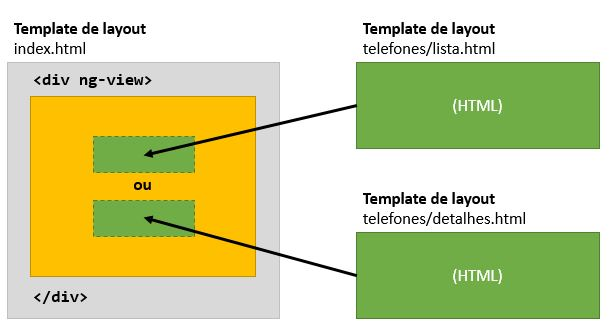

# Passo 8 - Roteamento e múltiplas Views

Nos passos anteriores, foi utilizado o conceito de "tela", que permite uma troca de contexto da interface gráfica. Entretanto, a abordagem utilizada (mostrar e ocultar conteúdo) não é a maneira mais adequada de realizar este procedimento, principalmente com o aumento da quantidade de funcionalidades (e de telas) do aplicativo.

Um aplicativo de única página (SPA) (do inglês *Single Page Appplication*) é um recurso de programação front-end que faz com que o aplicativo web não utilize o formato tradicional de troca de página, ou seja, há apenas uma única página e ocorrem trocas de telas. Esse conceito foi utilizado até o **passo 7** e continuará sendo utilizado no restante deste tutorial do Angular.

> Para saber mais

> Se quiser saber mais sobre o conceito de SPA, pode começar lendo esse artigo da wikipedia (em inglês): https://en.wikipedia.org/wiki/Single-page_application.

Até o passo 7, quando o usuário clica no botão "Detalhes", a tela de lista de telefones é ocultada e é apresentada a tela de detalhes do telefone. O Pass 8 utiliza o módulo `angular-route` para fornecer uma alternativa mais adequada.

## Dependências

O módulo `angular-route` fornece serviços necessários para que o aplicativo utilize o conceito de múltiplas views. 

O arquivo `package.json` precisa incluir o módulo `angular-route` nas suas dependências.

## Múltiplas views, Rotas e Template de Layout

Uma "**rota**" é um recurso que permite ao navegador mudar o endereço (a URL) atual sem, efetivamente, mudar de página. A princípio, isso pode soar estranho, mas é um recurso amplamente utilizado em desenvolvimento web moderno. O módulo `angular-route` fornece o serviço `$route`, que permite relacionar controllers, views e a URL atual do navegador.

Um "**template de layout**" é responsável por definir um template que é comum à todas as views do aplicativo. As views são chamadas de "**templates parciais**" porque incluem somente a parte do template que é necessária para cada tela.

## Estrutura do aplicativo

A partir de então, o aplicativo será organizado por "módulos". A estrutura de arquivos é a seguinte:

```
passo-8
│   app.css
│   app.js
│   index.html
│   package.json
│
├───data
│   └───phones
│           dell-streak-7.json
|           ...
│
├───img
│   └───phones
│           dell-streak-7.0.jpg
|           ...
│
├───node_modules
|   ...
│
└───telefones
        detalhes.html
        lista.html
        modulo.js

```

O diretório `telefones` representa o módulo **telefones**, que apresenta a lista e os detalhes de telefones. A ideia de separar o aplicativo em módulos representa uma proposta de arquitetura para o software que pretende isolar ou separar partes do software em módulos, isto é, se consegue, com isso, modularização.

## Template

O arquivo `index.html`, utilizado como **template de layout** é bastante modificado em relação ao **Passo 7**, como mostra o trecho de código a seguir:

```
<!doctype html>
<html lang="pt-br" ng-app="phonecat">
<head>
  ...
  <script src="node_modules/angular/angular.min.js"></script>
  <script src="node_modules/angular-route/angular-route.min.js"></script>
  <script src="telefones/modulo.js"></script>
  <script src="app.js"></script>
  ...
</head>
<body>
<div class="container">
    <div ng-view></div>
</div>
</body>
</html>
```

Na seção de arquivos JavaScript importados no arquivo `index.html` estão os arquivos:
* `node_modules/angular-route/angular-route.min.js` (do módulo `angular-route`)
* `telefones/modulo.js` (que implementa o módulo telefone)

A ordem de inclusão dos arquivos JavaScript é importante, uma vez que o arquivo `app.js` depende do módulo telefone.

### Diretiva `ng-view`

O módulo `angular-route` fornece a diretiva `ng-view`. Por meio dessa diretiva os **templates parciais** são dinamicamente embutidos neste local (dentro de `<div class="container">`).

A figura a seguir ajuda a ilustrar este conceito.



A figura demonstra que os **templates parciais** são incluídos de modo exclusivo dentro da `div` que está com a diretiva `ng-view`.

O módulo `angular-route` permite a utilização de apenas uma diretiva `ng-view` no **template de layout**.

## Código JavaScript do aplicativo

O código JavaScript do aplicativo PhoneCat muda bastante em relação ao **Passo 7**.

O arquivo `app.js` passa a ter o seguinte conteúdo:

```JavaScript
'use strict';

angular.module('phonecat', ['ngRoute', 'moduloTelefone'])
    .config(function($routeProvider){
        $routeProvider
            .when('/telefones', {
                templateUrl: 'telefones/lista.html',
                controller: 'TelefonesListaController'
            })
            .when('/telefones/:id', {
                templateUrl: 'telefones/detalhes.html',
                controller: 'TelefonesDetalhesController'
            })
            .otherwise({
                redirectTo: '/telefones'
            });
    });
```

### Dependências

A primeira novidade está em relação às dependências.

```JavaScript
angular.module('phonecat', ['ngRoute', 'moduloTelefone'])
```

Anteriormente, o aplicativo não possuía dependências, agora, são duas:
* módulo `ngRoute`
* módulo `moduloTelefone` (definido no arquivo `telefones/modulo.js`)

