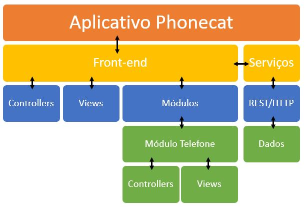

# REST e Serviços

Este passo apresenta uma abordagem diferente para usar o objeto XHR (e o recurso de AJAX) introduzido no **passo 8**. De outro ponto de vista, a abordagem está mais adequadamente relacionada com a forma como dados de APIs podem ser consultados utilizando o recurso REST.

## Dependências

O módulo `angular-resource` fornece os serviços necessários para consultar serviços no formato REST. A dependência pode ser adicionada ao projeto usando `npm`:

```
npm install angular-resource --save
```

## Arquitetura do aplicativo

O **passo 8** adicionou várias mudanças na arquitetura e na estrutura do aplicativo. O **passo 9** acrescenta uma **camada de serviços** na arquitetura. A figura a seguir ilustra a definição atual da arquitetura.



A camada **Front-end** utiliza a camada **Serviços**, que fornece os serviços de comunicação com os dados por meio da camada **REST**. Esta é uma abordagem interessante com o propósito principal de moduluarização da arquitetura. 

## Estrutura de arquivos

A estrutura de arquivos do projeto continua semelhante à do **passo 8**. A principal diferença é a presença do arquivo `/telefones/servico.js`. Em relação ao conteúdo dos arquivos, apenas são modificados os arquivos `index.html` e `/telefones/modulo.js`.

## Template

O arquivo `index.html` é modificado apenas para incluir os arquivos do módulo `angular-resource` e  `telefones/servico.js`:

```html
<!doctype html>
<html lang="pt-br" ng-app="phonecat">
<head>
...
  <script src="node_modules/angular/angular.min.js"></script>
  <script src="node_modules/angular-route/angular-route.min.js"></script>
  <script src="node_modules/angular-resource/angular-resource.min.js"></script>
  <script src="telefones/servico.js"></script>
  <script src="telefones/modulo.js"></script>
  <script src="app.js"></script>
...
</head>
<body>
...
</body>
</html>
```

## Módulo Telefones

O módulo **Telefones** é modificado para implementar o conceito de serviço e para alterar os controllers deste módulo para usarem o serviço criado.

### Serviço

Um **serviço** é outro mecanismo de modularização do Angular, sendo fornecido por um módulo. Assim, primeiro tem-se um módulo e, então, os serviços que ele fornece.

O arquivo `telefones/servico.js` define o módulo `phonecatServices` e o serviço `Telefones`:

```javascript
'use strict';

angular.module('phonecatServices', ['ngResource'])
    .factory('Telefones', function($resource) {
        return $resource('data/phones/:phoneId.json', {}, {
            query: {
                method: 'GET',
                params: { phoneId: 'phones' },
                isArray:true
            }
        });
    });
```

O módulo `phonecatServices` depende do módulo `ngResource` (`angular-resource`).

A função `factory()` representa o conceito **factory** do Angular, e recebe dois parâmetros:
1. O nome do serviço (`Telefones`, neste caso)
2. A função que define o serviço. Neste caso, é injetado o objeto `$resource` (fornecido pelo módulo `angular-resource`).

O objeto `$resource` é utilizado como uma função para a qual são passadas três parâmetros:
1. Uma rota na qual o serviço é baseado
2. Um objeto sem definição/vazio
3. Um objeto que fornece ações para o serviço REST

O objeto vazio permite definir valores-padrões para os parâmetros da rota. 

#### Rota do serviço

A rota do serviço é `data/phones/:phoneId.json`. Como já visto no **passo 8** uma rota pode possuir parâmetros. Desta forma, a rota possui o parâmetro `phoneId`.

#### Ações

As ações para os serviços REST remetem aos verbos do HTTP. As ações-padrões incluem GET, SAVE e DELETE.

Além das ações-padrões é possível fornecer ações personalizadas, o que é feito por meio do terceiro parâmetro para `$resource()`.

```javascript
{
  query: {
    method: 'GET',
    params: { phoneId: 'phones' },
    isArray:true
  }
}
```

O objeto possui o atributo `query` (que se torna o nome da ação personalizada). O conteúdo do atributo é um objeto que possui:
* atributo `method`, com valor `GET`, indicando que esta ação é uma ação que usa o verbo GET do HTTP
* atributo `params`, com valor `{phoneId:'phones'}`, indicando que o valor padrão para o parâmetro de rota `phoneId` é `phones`
* atributo `isArray`, com valor `true`, indicando que o retorno da requisição HTTP deve ser tratado como array (lista).

## Controllers

Uma vez definido o serviço `Telefones` no módulo `phonecatServices`, este pode ser utilizado por outros módulos. Assim, o arquivo `telefones/modulo.js` tem uma alteração na declaração do módulo `moduloTelefone` para incluir uma dependência para o módulo `phonecatServices`:

```javascript
angular.module('moduloTelefone', ['phonecatServices'])
```

Por causa da dependência, o serviço `Telefones` pode ser injetado nos controllers e, assim, suas ações podem ser utilizadas como uma camada intermediária entre os controllers e a API REST.

### TelefonesListaController

O controller `TelefonesListaController` injeta o serviço `Telefones` e utiliza a ação `query()` para consultar os dados da lista de telefones.

```javascript
.controller('TelefonesListaController', function($rootScope, $scope, $http, Telefones){
    $rootScope.pageTitle = 'Telefones - PhoneCat';
    $scope.telefones = Telefones.query();
})
```

O objeto `$scope.telefones` recebe o retorno da função `query()`.

Um conceito importante aqui é chamado de **promise**. A maneira mais simples de entender este conceito é olhar para a linha a seguir:

```javascript
$scope.telefones = Telefones.query();
```

Anteriormente, ao utilizar o serviço `$http`, foi colocado em prática o conceito de **funções callback** que executam código de forma assíncrona permitem executar código ao final da execução, por exemplo.

Ao utilizar **promise** o código continua utilizando uma chamada assíncrona, entretanto, ela é gerenciada pelo próprio Angular, que também dá uma garantia de que o que se espera como retorno da função seja atribuído a uma variável ou utilizado de outra forma. Em outras palavras, o Angular garante a expectativa futura. Neste caso, a expectativa futura é que a função `query()` retorne uma lista (array) de telefones. Assim, uma **promise** é uma maneira de o Angular "prometer" para o código que a sua expectativa será cumprida.

A mudança na arquitetura do software ajudou, também, a ocultar detalhes do código. O código do controller `TelefonesListaController` não tem acesso ao endereço do arquivo dos dados dos telefones. Isso fica isolado no serviço `Telefones`.

### TelefonesDetalhesController

O controller `TelefonesDetalhesController` também injeta o serviço `Telefones`:

```javascript
.controller('TelefonesDetalhesController', function($rootScope, $scope, $http, $routeParams, Telefones){
    $scope.telefone = Telefones.get({phoneId: $routeParams.id}, function(telefone){
        $scope.telefone.imageUrl = telefone.images[0];
        $rootScope.pageTitle = telefone.name + ' - Phonecat';
    });
    $scope.mostrarImagem = function(imagem) {
        $scope.telefone.imageUrl = imagem;
    };
});
```

O código do controller utiliza uma ação padrão `get()` para consultar os dados de um telefone. A função `get()` também retorna uma **promise**. A diferença para o código do controller anterior é que uma função **callback** é utilizada para realizar um determinado trecho do código (definir a imagem padrão e o título da janela do browser com base nos dados do telefone em questão).

## Resumo

O **passo 9** realiza modificações na arquitetura do software ao utilizar o conceito de **serviços personalizados**. Por meio dos serviços, que criam uma camada para acessar os dados via REST, os módulos e controllers do software não têm acesso a certos detalhes, como o endereço do arquivo de dados. Ainda, o código atual utiliza o conceito de **promise**, como maneira alternativa para acessar dados dos serviços.

