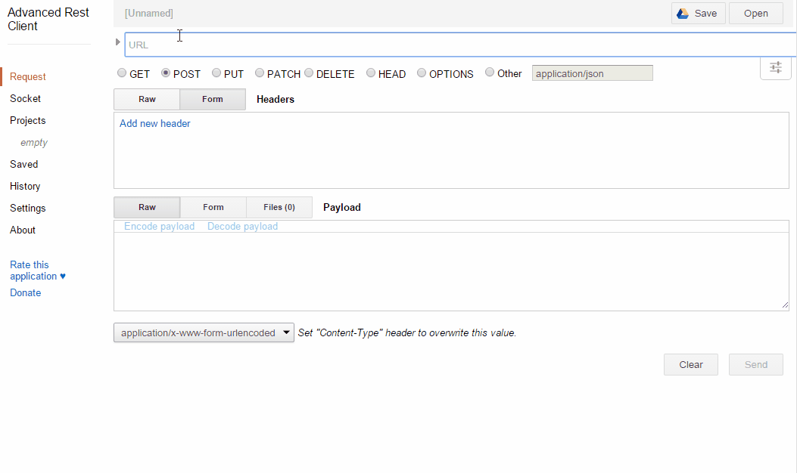

# Request

Além de ser possível informar dados para o controller por meio de parâmetros de rota, é possível utilizar a classe `Request` para acessar variáveis informadas via GET ou POST, por exemplo. A classe `Request` pertence ao **Symfony**, pacote requerido pelo Silex, e está disponível em `Symfony\Component\HttpFoundation\Request`. Algumas das principais propriedades são:
- `$attributes`: retorna parâmetros personalizados
- `$request`: retorna parâmetros de requisições POST (objeto `$_POST` do PHP)
- `$query`: retorna parâmetros de URL (objeto `$_GET` do PHP)
- `$server`: retorna informações do servidor web (objeto `$_SERVER` do PHP)
- `$files`: retorna arquivos enviados via upload (objeto `$_FILES` do PHP)
- `$cookies`: retorna variáveis armazenadas em cookies (objeto `$_COOKIE` do PHP)
- `$headers`: retorna cabeçalhos da requisição (extraídos de `$_SERVER`)

As propriedades `$attributes`, `$request`, `$query` e `$cookies` são do tipo `ParameterBag`, cujos principais métodos são apresentados a seguir.

|Tipo de retorno|Método|Descrição|
|---------------|------|---------|
|`array`        |`all()`|Retorna os parâmetros (como `array`)|
|`array`        |`keys()`|Retorna as chaves (nomes dos parâmetros)|
|misto          |`get($chave, $default, $deep)`|Retorna um parâmetro pelo nome (chave) com valor padrão igual a `$default` (padrão é `null`)|
|`bool`         |`has($chave)`|Retorna `true` se o parâmetro estiver definido|
|`int`          |`count()`|Retorna a quantidade de parâmetros|

Além destes, há outros métodos que retornam valores convertendo-os para tipos específicos:
- `getInt()`: retorna o parâmetro com valor convertido para inteiro
- `getBoolean()`: retorna o parâmetro com valor convertido para booleano

As seções a seguir apresentam a utilização destas propriedades.

## Parâmetros de URL

Parâmetros de URL estão presentes na URL, seguindo o formato: `nome=valor` (separardos por `&`, no caso de mais de um parâmetro). Por exemplo, a URL  `http://localhost/pessoas/?s=Jose&i=1&o=nome` possui os seguintes parâmetros:
- `s` com valor `Jose`
- `i` com valor `1`
- `o` com valor `nome`

Para ter acesso a estes parâmetros de URL deve ser utilizada a propriedade `$query`, como mostra o exemplo:

```php
require_once 'vendor/autoload.php';

use Silex\Application;
use Symfony\Component\HttpFoundation\Request;

$app = new Silex\Application();

$app->get('/', function(Application $app, Request $request) {
    return $request->query->get('id');
});

$app->run();
```

Para usar as classes `Silex\Application` e `Symfony\component\HttpFoundation\Request`, é necessário incluí-las no código. isso é feito por meio da instrução `use`, utilizada nas linhas 3 e 4.

No controller, estão sendo injetados dois objetos: `$app` (do tipo `Application`) e `$request` (do tipo `Request`). Para acessar o parâmetro de URL `id` é utilizada a propriedade `$query` e o método `get()`.

Para acessar o aplicativo, deve ser utilizada a URL `http://localhost/?id=1`. Assim, o controller acessa o parâmetro `id`, com valor `1`.

### Integração com Angular

O capítulo sobre Angular demonstrou que o serviço `$http` está disponível e permite realizar requisições HTTP. A primeira forma de integração entre o aplicativo Angular e o Silex é por meio da utilização de parâmetros de URL. Para isso, o aplicativo precisa do frontend e do backend.

#### Backend

Do lado do backend, o aplicativo contém um controller que trata a rota `/`. Este controller espera por dois números via dois parâmetros de URL: `numero1` e `numero2`:

```php
$app->get('/', function(Application $app, Request $request) {
    $numero1 = $request->query->get('numero1', 0);
    $numero2 = $request->query->get('numero2', 0);
    return ($numero1 + $numero2);
});
```

Como os dados serão transmitidos via GET, a rota `/` é tratada via este protocolo. O código acessa os parâmetros de URL por meio de `$request->query->get()`, calcula a soma e retorna o resultado.

#### Frontend

Do lado do frontend, o código de exemplo desta seção está nos arquivos `index.html` e `app.js`. No arquivo `index.html` há o trecho:

```html 
<body ng-controller="Home">
    <p>Número A: <input type="text" ng-model="numero1"></p>
    <p>Número B: <input type="text" ng-model="numero2"></p>
    <p><button ng-click="somar()">Somar</button>    
    <p>Resultado da soma: {{resultado}}</p>
</body>

```

O trecho de código refere-se à view do controller `Home`.

O código a seguir apresenta o arquivo `app.js`:

```javascript
angular.module('silex-request-get', [])
.controller('Home', function($scope, $http){
    $scope.somar = function() {
        $http.get('/livro-web-codigo-fonte/backend/request-angular-get/', {
            params: {numero1 : $scope.numero1, numero2 : $scope.numero2}
        }).then(function(response){
            $scope.resultado = response.data;
        });
    };
});
```

No controller `Home` o serviço `$http` está sendo utilizado para criar uma requisição GET para a URL `/livro-web-codigo-fonte/backend/request-angular-get/` e informa os parâmetros que representam os dois números a serem enviados para o backend por meio do segundo parâmetro: um objeto que possui o atributo `params` que, efetivamente, define quais são os parâmetros enviados para o backend. Aqui, perceba que o valor de `params` é um objeto com dois atributos `numero1` e `numero2`. Não por acaso, os nomes destes atributos referem-se aos nomes dos parâmetros de URL esperados no backend. Os valores dos atributos estão vinculados ao model correspondente.

Uma vez que a requisição GET tenha ocorrido com sucesso, a variável `$scope.resultado` recebe o valor de `response.data`. O objeto `response`, neste caso, parâmetro da função anônima que trata o sucesso da requisição GET, contém informações sobre a resposta enviada pelo backend. O atributo `data` contém o conteúdo da resposta.

## Requisições POST

O que se pode perceber com as requisições GET é que os dados (variáveis ou parâmetros de URL) ficam visíveis na URL. Entretanto, pode ser que isso não seja a maneira mais adequada. Uma vez que estes dados ficam visíveis inclusive em logs de acesso, dados com requisitos de segurança não podem ser transmitidos desta forma. Assim, a segunda forma, requisições POST, fornece uma maneira de enviar dados diretamente no cabeçalho da requisição HTTP.

Para ter acesso aos dados via deve ser utilizada a propriedade `$request` (do objeto `$request`), como mostra o exemplo:

```php
require_once 'vendor/autoload.php';

use Silex\Application;
use Symfony\Component\HttpFoundation\Request;

$app = new Silex\Application();

$app->post('/', function(Application $app, Request $request) {
    return $request->request->get('id');
});

$app->run();
```

Enquanto os parâmetros de URL estão presentes na URL da requisição, isso não acontece com os dados enviados via POST. Assim, não é possível (ou não tão fácil) criar requisições POST diretamente no navegador. Por isso, esta seção apresenta duas formas de fazer isso. A primeira delas, apresentada a seguir, usa o mesmo formato de requisição integrada com o Angular. A segunda, utiliza uma extensão para o Google Chrome, que pode ser usada para qualquer tipo de requisição, inclusive, GET ou POST.

### Integração com Angular

#### Backend

A integração com o Angular, no caso de requisições POST, implica em um pequeno problema: o formato como os dados estão codificados no cabeçalho da requisição HTTP. Por padrão, o Silex espera que as requisições estejam codificadas com `application/x-www-form-urlencoded`, mas o Angular as codifica com `application/json` (uma vez que os dados são sempre tratados em formato JSON). Por causa disso, é necessário tratar a requisição, convertendo os dados para o formato adequado do Silex.

Para facilitar este trabalho, uma classe chamada `AngularPostRequestServiceProvider` é utilizada como um serviço do aplicativo Silex, de modo a fazer as conversões necessárias entre o formato do Angular e o formato do Silex.

O código do backend é o seguinte:

```php
require_once 'vendor/autoload.php';

use Silex\Application;
use Symfony\Component\HttpFoundation\Request;
use Lpweb\AngularPostRequestServiceProvider;

$app = new Silex\Application();
$app['debug'] = true;
$app->register(new AngularPostRequestServiceProvider());

$app->post('/', function(Application $app, Request $request) {
    $data = $request->request->get('data');
    $numero1 = $data['numero1'];
    $numero2 = $data['numero2'];
    return ($numero1 + $numero2);
});

$app->run();
```

Perceba que é utilizada a coleção `$request` (do objeto `$request`) e o nome da chave é `data`. Esta é a chave utilizada pelo Angular para enviar os dados para o backend. Assim, a primeira linha do controller acessa a chave `data` e as linhas seguintes acessam os valores `numero1` e `numero2` já como elementos do vetor `data`. O restante do código não muda em relação ao backend para as requisições GET.

#### Frontend

O Frontend muda pouco em relação às requisições GET: ao invés de utilizar a função `get()` do serviço `$http`, é usada a função `post()`; ao invés de utilizar o atributo `params` do objeto de configuração, usa-se o atributo `data`:

```javascript
angular.module('silex-request-get', [])
.controller('Home', function($scope, $http){
    $scope.somar = function() {
        $http.post('/livro-web-codigo-fonte/backend/request-angular-post/', {
            data: {numero1 : $scope.numero1, numero2 : $scope.numero2}
        }).then(function(response){
            $scope.resultado = response.data;
        });
    };
});
```

### Aplicativo Advanced REST Client

O aplicativo *Advanced REST Client* para o Google Chrome (https://chrome.google.com/webstore/detail/advanced-rest-client/hgmloofddffdnphfgcellkdfbfbjeloo) é outra forma de gerar requisições via navegador e testar a comunicação com o backend.

Após instalar o aplicativo realize os seguintes passos:
- Informe a URL (não se esqueça de indicar `/` ao final, pois representa a rota)
- Escolha "POST" como o tipo da requisição
- Na seção *Payload*, na aba *Raw*, informe o conteúdo da requisição (em formato JSON)
- Escolha "application/json" como codificação da requisição
- Clique no botão "Send"

Sobre o conteúdo da requisição, deve ser informado da mesma forma com o Angular o  faria (já que o backend está esperando este formato). Assim, o conteúdo deve ser JSON, como o exemplo:

```
{"data":{"numero1":1,"numero2":3}}
```

A figura a seguir ilustra este processo (*animação GIF disponível apenas na versão online deste livro*).



Assim, o aplicativo *Advanced REST Client* para o Google Chrome pode ser usado como alternativa para criar clientes de backends construídos com Silex e outros frameworks para o PHP ou outras plataformas de programação.
