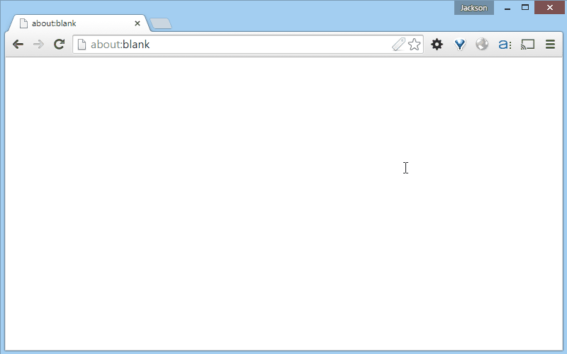

# JavaScript

[**JavaScript (ou ECMAScript)**](http://www.ecmascript.org/) é a principal linguagem de programação da internet. As semelhanças com a linguagem Java são bastante notáveis, bem como as diferenças.

## Execução no browser

JavaScript é uma linguagem executada no browser de forma interpretada. Isso quer dizer que o código JavaScript não é compilado, mas interpretado em tempo de execução.

A ordem de execução do código é feita de cima para baixo, conforme o código estiver presente no documento. Entender esta ordem de execução é importante para facilitar não apenas o entendimento da execução do programa, mas também a correção de erros. Por ser uma linguagem interpretada, a execução das linhas subsequentes a uma linha com erro não é efetuada. Isso pode gerar problemas na execução do código. Para para aprender melhor como lidar com o fluxo de execução do código, você pode utilizar a função **inspetor** do seu browser (está disponível na maioria dos navegadores modernos). A animação a seguir demonstra como utilizar o inspetor (ativado ao pressionar a tecla F12).



## Inclusão no documento

Código JavaScript é inserido no documento por meio do elemento `script`. Exemplo:

```html
<html>
<head>
    <script>
	    alert('Javascript em execução!');
    </script>
</head>
<body>
</body>
</html>
```

### Código externo

Além de incluir o código JavaScript diretamente no documento, junto do HTML, você pode manter o código em um arquivo separado, com a extensão `.js` e incluí-lo no seu documento. No exemplo a seguir, o código está no arquivo `script.js` e é incluído no documento por meio do elemento `script` e o atributo `src`:

```html
<script src="script.js"></script>
```

Para aprender mais sobre o JavaScript, acesse o [curso de JavaScript do W3Schools](http://www.w3schools.com/js/default.asp).

Aqui no curso, o conteúdo de JavaScript será dividido entre entendimento da sintaxe, manipulação do HTML e utilização de bibliotecas e ferramentas, como jQuery e AngularJS.

Entender a sintaxe do JavaScript é uma tarefa fundamental para o andamento do curso. A seção seguinte (Javascript) apresenta os elementos principais da linguagem:

- [sintaxe](sintaxe.md)
- [tipos de dados](tipos-de-dados.md)
- [condicionais](condicionais.md)
- [laços de repetição](lacos-de-repeticao.md)
- [funções](funcoes.md)
- [objetos](objetos.md)
