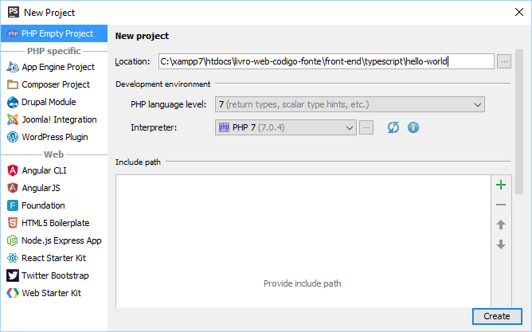
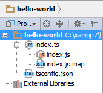
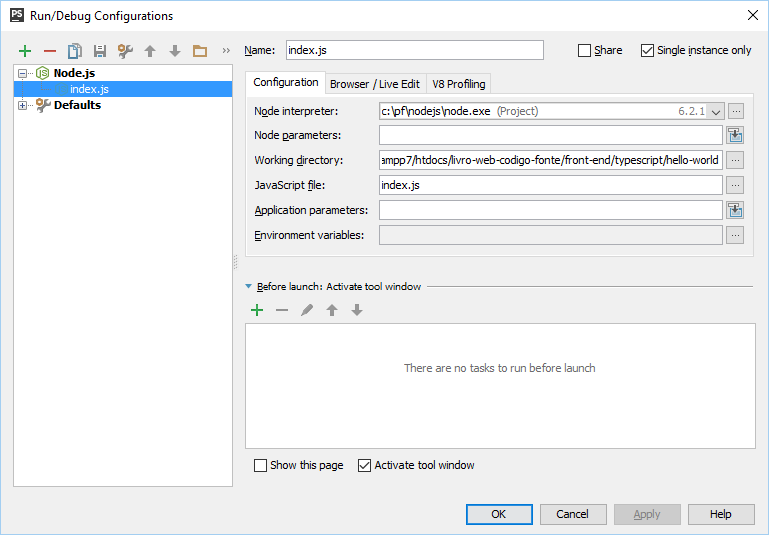
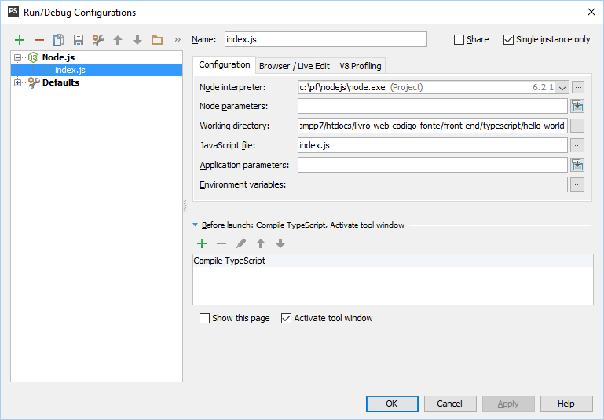
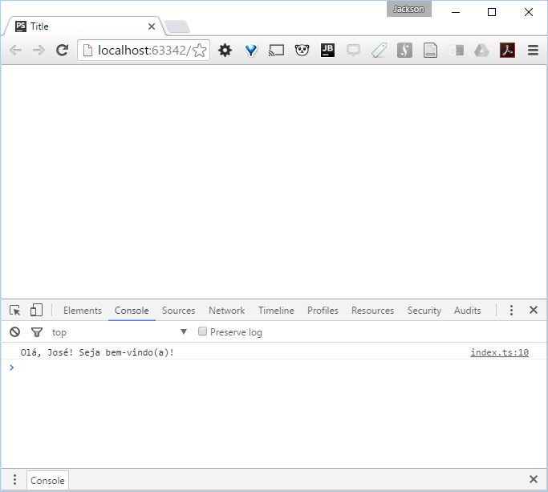

# Quickstart

Este capítulo permite um início rápido à utilização do TypeScript e a configuração do PHPStorm como IDE de programação. As seções a seguir apresentam a criação de três projetos que demonstram os recursos do TypeScript de forma simples e objetiva.

## Projeto Hello World!

Um projeto básico, do tipo "hello world", pode ser criado no PHPStorm seguindo os seguintes passos.

### Criar o projeto

Por meio do menu _File -&gt; New Project_ crie um novo projeto. Na janela _New Project_ escolha o tipo de projeto _PHP Empty Project_ e informe onde os arquivos serão armazenados.



### Configurar o suporte para o TypeScript

Por meio do menu _File -&gt; Default Settings_ (para configurar apenas o projeto atual use apenas _Settings_) na página _Languages & Frameworks -&gt; TypeScript_ informe a localização do NodeJS e marque as opções _Enable TypeScript Compiler_ e _Track changes_. Por fim, escolha a opção _Use tsconfig.json_.    


Após fazer essa configuração para o modo padrão (_Default settings_) você não precisará fazer isso novamente para **novos** projetos.

### Hora do código

Crie o arquivo _index.ts_ com o conteúdo a seguir.

```typescript
function mensagem(nome) {
    return "Olá, " + nome + "! Seja bem-vindo(a)!";
}
var pessoa = "José";
console.log(mensagem(pessoa));
```

Se você já conhece JavaScript certamente está pensando: mas... isso é JavaScript! E é isso mesmo. Veremos mais sobre isso daqui a pouco.

### Execute o código

Por meio do PHPStorm é possível executar código TypeScript usando o NodeJS. Você também pode usar o formato padrão de incorporar o código em uma página HTML e executá-lo no browser. Entretanto, um procedimento anterior precisa ser feito. O NodeJS e o browser não entendem TypeScript. Assim, será necessário usar o processo conhecido como "transpiling" (algo como "transpilar") para traduzir o código TypeScript para JavaScript.

Antes de escolher um modo de execução, é necessário configurar o PHPStorm.

Crie o arquivo _tsconfig.json_. O PHPStorm já tem um template padrão. Basta usar o menu _File -&gt; New_ e escolher o template _tsconfig.js File_. O conteúdo desse arquivo será algo como o seguinte.

```json
{
  "compilerOptions": {
    "module": "commonjs",
    "target": "es5",
    "sourceMap": true
  },
  "exclude": [
    "node_modules"
  ]
}
```

Não vou explicar o significado disso agora. Veremos isso mais adiante. Por enquanto, entenda que esse arquivo é parte do processo.

Depois disso, o painel do TypeScript mostrará erros de compilação em tempo-real. Por enquanto, com o código contendo, na verdade, conteúdo JavaScript, não será possível notar o poder desta ferramenta. Mas, para vê-la em ação, modifique o código, gerando um erro de sintaxe, por exemplo. A figura a seguir exemplifica esse processo.


A figura mostra que o painel TypeScript indicou vários erros no arquivo. Isso é de grande ajuda. Esse processo de "compilação" ocorrerá automaticamente, após cada mudança no arquivo _index.ts_.

Também como resultado do processo de "compilação", foram gerados dois arquivos: _index.js_ e _index.js.map_. O primeiro deles é um arquivo JavaScript, que tem o mesmo conteúdo do arquivo _index.ts_, como seria de se esperar. O segundo é um arquivo utilizado pelo PHPStorm, para identificar pontos de transformações entre os arquivos TypeScript e JavaScript.



#### Executando no NodeJS

Abra o arquivo _index.js_ e, por meio do menu _Run -&gt; Run_, execute o arquivo. No menu flutuante escolha _index.js_. O painel Run apresentará o resultado da execução.


Efetivamente, o arquivo _index.js_ está sendo executado pelo NodeJS, não o arquivo _index.ts_. Não se perca aqui. A configuração do PHPStorm indica que sempre que houver uma modificação no arquivo _index.ts_ então ele será compilado, gerando o arquivo _index.js_. Por isso não há um problema com essa forma de trabalho. Se você quiser garantir adicionalmente (manualmente) a compilação do arquivo TypeScript pode seguir o passo seguinte.

Use o menu _Run -&gt; Edit configurations_ para abrir a janela _Run\Debug Configurations_. A figura a seguir ilustra a janela no momento.



Clique no sinal "+" e escolha _Node.js_. Na opção _JavaScript file_ informe _index.js_. Na seção _Before launch: Activate tool window_ clique no sinal "+" e escolha _Compile TypeScript_.



#### Executando no browser

Crie o arquivo _index.html_, com o conteúdo a seguir.

```html
<!DOCTYPE html>
<html lang="en">
<head>
    <meta charset="UTF-8">
    <title>Title</title>
    <script src="index.js"></script>
</head>
<body>
</body>
</html>
```

Clique sobre o arquivo com o botão direito do mouse e escolha _Run index.html_. Isso vai abrir uma janela do browser.



A página está em branco (sem conteúdo). Por isso, para ver a saída, ative o painel de desenvolvedor e escolha a aba _Console_. Um fluxo de trabalho interessante é não fechar a janela do browser. Mantenha-a aberta e, após alterações no TypeScript, atualize-a utilizando a tecla _F5_.

Esses modos de execução não são certamente úteis em qualquer tipo de trabalho. Para o momento inicial, entretanto, funcionam muito bem. Escolha um deles e bom trabalho!

## Hello World, TypeScript!

Como já disse, o projeto Hello World não apresenta diferenças entre o TypeScript e o JavaScript. Então, vamos começar a fazer algumas modificações no código: adicionar tipos.

O TypeScript permite a definição de tipos de dados para variáveis. Com isso, o código do arquivo *index.ts* é modificado para o seguinte.

```typescript
function mensagem(nome: string) {
    return "Olá, " + nome + "! Seja bem-vindo(a)!";
}
var pessoa:string = "Maria";
console.log(mensagem(pessoa));
```

O código adiciona duas modificações importantes:

1. A variável `pessoa` é do tipo `string`. A sintaxe `nome: tipo` é típica do TypeScript para indicar esse tipo de informação;
2. Na função `mensagem()` o parâmetro `nome` é do tipo `string`.

Verifique a comparação com o arquivo _index.js_.

<table>
<tr>
<td>index.ts</td>
<td>index.js</td>
</tr>
<tr>
<td>
<pre lang="typescript">
function mensagem(nome: string) {
 return "Olá, " + nome + "! Seja bem-vindo(a)!";
}
 var pessoa:string = "Maria";
 console.log(mensagem(pessoa));
</pre>
</td>
<td>
<pre lang="javascript">
function mensagem(nome) {
 return "Olá, " + nome + "! Seja bem-vindo(a)!";
}
var pessoa = "Maria";
console.log(mensagem(pessoa));
</pre>
</td>
</tr>
</table>


Como se poderia esperar, o código JavaScript continua idêntico, mesmo com a utilização de tipos de dados no arquivo TypeScript.
Modifique o arquivo _index.ts_ mais uma vez.

```typescript
function mensagem(nome: string) {
    return "Olá, " + nome + "! Seja bem-vindo(a)!";
}
var pessoa:number = 1;
console.log(mensagem(pessoa));
```

Esse é um erro simplório, certamente, mas demonstra recursos interessantes.

A variável `pessoa` tem o tipo `number` (representa um valor numérico). Segundo, na chamada da função `mensagem()` há um erro: não se pode atribuir um valor do tipo `number` para um parâmetro do tipo `string`.

Tanto o editor quanto o painel TypeScript apresentam indicações do erro.


Isso é muito interessante do ponto-de-vista do desenvolvedor, principalmente para grandes projetos.

Os próximos dois projetos apresentarão recursos voltados para a programação orientada a objetos.

## Hello World, Interfaces!

Interfaces são um recurso muito importante em linguagens fortemente tipadas, como Java e C#. Com TypeScript não é diferente, pois esse recurso também está disponível. Modifique o arquivo _index.ts_ para o seguinte.

```typescript
interface Pessoa {
    primeiroNome: string;
    ultimoNome: string;
}

function mensagem(pessoa: Pessoa) {
    return "Olá, " + pessoa.primeiroNome + " " + pessoa.ultimoNome + "! Seja bem-vindo(a)!";
}

var pessoa:Pessoa = {
    primeiroNome: "José",
    ultimoNome: "Silva"
}

console.log(mensagem(pessoa));
```

Vamos por partes. Primeiro, a definição da interface Pessoa.

```
interface Pessoa {
    primeiroNome: string;
    ultimoNome: string;
}
```

A sintaxe é interface `Nome { lista de atributos e métodos }`. Neste caso, o código define a interface `Pessoa`, que tem os atributos `primeiroNome` (do tipo `string`) e `ultimoNome` (também `string`).

Geralmente, as linguagens de programação mais conhecidas requerem que o código crie uma classe para implementar a interface. Com TypeScript isso não é necessário.

```
var pessoa:Pessoa = {
    primeiroNome: "José",
    ultimoNome: "Silva"
}
```

O código cria a variável `pessoa`, do tipo `Pessoa`. O valor atribuído a ela representa uma "estrutura" que combina com a definição da interface `Pessoa`. Isso é tudo. Não é necessário criar uma classe que implementa a interface para criar uma instância de objeto com a sua estrutura.

Agora é sua vez de brincar um pouco. Veja o código do arquivo _index.js_. O que mudou? Perceba como o PHPStorm ajuda na completação de código. Gere erros no código para ver o resultado da compilação.

## Hello World, agora com classe!
Juntamente com o recurso de interfaces, a utilização de classes em programação orientada a objetos permite a definição de uma estrutura de dados. A seguir, o código do arquivo _index.ts_.

```typescript
interface Pessoa {
    primeiroNome: string;
    ultimoNome: string;
}

class Aluno {
    nome: string;
    constructor(public primeiroNome:string, public ultimoNome:string) {
        this.nome = primeiroNome + " " + ultimoNome;
  }
}

function mensagem(pessoa: Pessoa) {
    return "Olá, " + pessoa.primeiroNome + " " + pessoa.ultimoNome + "! Seja bem-vindo(a)!";
}

var pessoa = new Aluno("José", "Silva");

console.log(mensagem(pessoa));
```

Mais uma vez, vamos por partes. Primeiro, a definição da classe `Aluno`.

```
class Aluno {
    nome: string;
    constructor(public primeiroNome:string, public ultimoNome:string) {
        this.nome = primeiroNome + " " + ultimoNome;
    }
}
```

A sintaxe é `class Nome { definições }`. Neste caso, ocorre o seguinte:
*  A classe `Aluno` possui o atributo `nome`, do tipo `string`;
* O construtor da classe (definido pela função `constructor()` -– perceba que não é utilizada a palavra `function`) aceita dois parâmetros: `primeiroNome`, do tipo `string`, e `ultimoNome`, também `string`.

Os parâmetros do construtor da classe `Aluno` também são marcados com `public`. Isso quer dizer que o código está utilizando um recurso da linguagem que cria, automaticamente, atributos públicos conforme esses parâmetros do construtor.

Agora... veja o que aconteceu com o arquivo _index.js_. Certamente, o código demonstra o emprego de um esforço maior para conseguir o mesmo recurso.

A variável pessoa recebe uma instância (objeto) de `Aluno`. Na sequência, algo chama a atenção. A definição da função `mensagem()` indica que ela continua aceitando um parâmetro do tipo `Pessoa`. Entretanto, a chamada da função indica que está sendo passado um valor do tipo `Aluno`. O que chama a atenção é que a compilação não indicou erros. O que acontece?

Estruturas de dados representadas por interfaces, classes e objetos têm uma relação bem próxima. O TypeScript interpreta, na verdade, a correspondência da estrutura do valor. Como a estrutura da variável `pessoa` (que é do tipo `Aluno`) combina com a estrutura do parâmetro pessoa da função `mensagem()` (que é do tipo `Pessoa`), não há erro. Aqui, "combinar" significa: ambos os tipos de dados contêm os atributos `primeiroNome` e `ultimoNome` (com seus tipos de dados correspondentes).

Esse é o mesmo recurso que torna válido o código a seguir.

```
var pessoa = { primeiroNome: "José", ultimoNome: "Silva" };
```

O objeto atribuído à variável `pessoa` contém a estrutura esperada para combinar com o tipo do parâmetro da função `mensagem()`.

Isso conclui o **Quickstart**.
